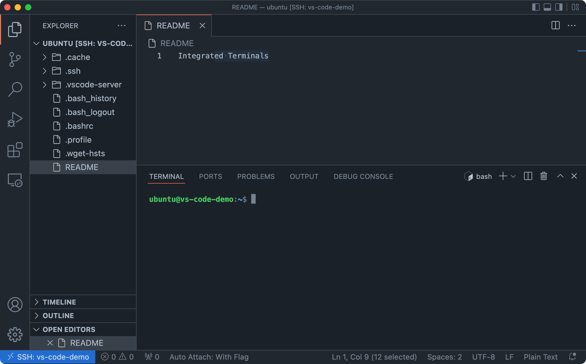
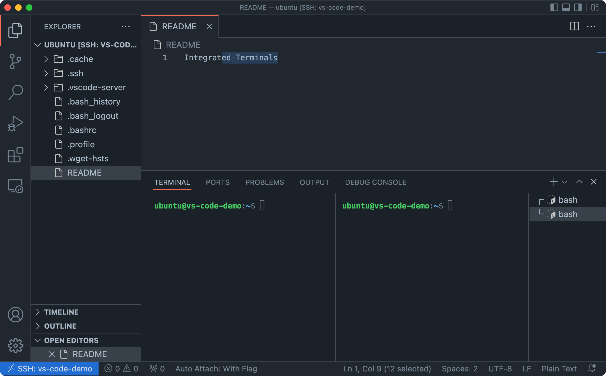

The [Visual Studio Code Integrated Terminal](https://code.visualstudio.com/docs/editor/integrated-terminal) is a handy, full-featured terminal emulator available right in VS Code. My typical workflow for projects often involves using VS Code and the integrated terminal in tandem.

Below is a curated list of shortcuts I am either using (or would like to remember to use!) with the VS Code Integrated Terminal on macOS. A complete list of shortcuts is available in VS Code: open the keyboard shortcuts page (`Command ⌘` + `Shift` + `P` > `Preferences: Open Keyboard Shortcuts`) and search for "Terminal" to view or change relevant shortcuts.

## Opening the Terminal



| Shortcut         | Comment                    |
| ---------------- | -------------------------- |
| `Ctrl` + `` ` `` | Open / hide terminal panel |

## Terminal Groups



| Shortcut                    | Comment                                |
| --------------------------- | -------------------------------------- |
| `Command ⌘` + `\`           | Create a new split terminal            |
| `Ctrl`+ `Shift` + `` ` ``   | Create a new terminal                  |
| `Command ⌘` + `Shift` + `]` | Focus next terminal group              |
| `Command ⌘` + `Shift` + `[` | Focus previous terminal group          |
| `Command ⌘` + `Shift` + `↓` | Focus next split terminal in group     |
| `Command ⌘` + `Shift` + `↑` | Focus previous split terminal in group |

## Navigating the Terminal

For macOS, to use many of the shortcuts to move around the terminal, we need to treat the `Option` (`⌥` / `alt`) key as the meta key within VS Code. In your JSON settings for VS Code (`Command ⌘` + `Shift` + `P` > `Open User Settings (JSON)`) add the following line:

```json
"terminal.integrated.macOptionIsMeta": true
```

The Emacs shortcuts, below, work in both Zsh (which, by default, uses Emacs-bindings with zle) and Bash (which uses [`readline` commands](https://www.gnu.org/software/bash/manual/html_node/Bindable-Readline-Commands.html)).

### Moving

| Shortcut         | Description        |
| ---------------- | ------------------ |
| `Ctrl`+`a`       | Beginning of line  |
| `Ctrl`+`e`       | End of line        |
| `Ctrl`+`b` / `←` | Backward character |
| `Ctrl`+`f` / `→` | Forward character  |
| `Meta`+`f`       | Forward word       |
| `Meta`+`b`       | Backward word      |

### History

| History    | Description            |
| ---------- | ---------------------- |
| `Ctrl`+`r` | Reverse history search |

### Changing Text

| Shortcut   | Description  |
| ---------- | ------------ |
| `Ctrl`+`l` | Clear screen |
| `Ctrl`+`g` | Cancel       |
| `Ctrl`+`_` | Undo         |

### Copy & Paste

| Shortcut   | Description                  |
| ---------- | ---------------------------- |
| `Meta`+`d` | Cut word after cursor        |
| `Ctrl`+`w` | Cut word before cursor       |
| `Ctrl`+`d` | Cut one character            |
| `Ctrl`+`k` | Cut everything before cursor |
| `Ctrl`+`y` | Paste                        |

### Vim

Vim + Zsh users may prefer using [vi-mode](https://github.com/jeffreytse/zsh-vi-mode) instead of learning the above shortcuts, while Vim + Bash users can similarly [set their mode](https://dev.to/brandonwallace/how-to-use-vim-mode-on-the-command-line-in-bash-fnn) to Vim.
